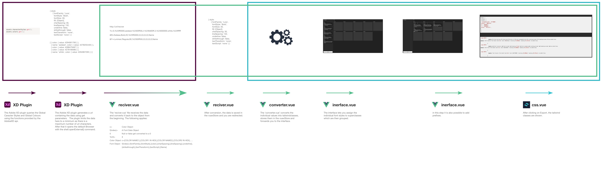

<p align="center"></p><br/>


This is in development!
# The Web side of an Adobe XD Plugin for Exporting global colors and caracter styles to Tailwind

This website converts the data transmitted by an Adobe XD plugin into tailwind classes. 
This website also gives you the possibility to reorder the classes via an interface.

The Plugin exprts your global Colors and Caracter styles to an self-written converter (this one) which converts the data to tailwind classes. 

[Adobe XD Plugin](https://github.com/theLeroy/TailwindExportPlugin)
<br/>
<br/>

## Todos for Devloper
- Improve the readme
- Make a Prview Tab for the Typo Styles
- Host on public Web Server
- Beautify interface
- publish the extension


## Build Setup

```bash
# install dependencies
$ yarn install

# serve with hot reload at localhost:3000
$ yarn dev

# build for production and launch server
$ yarn build
$ yarn start

```
## How to use
To install the plugin extension, please refer to the [readme](https://github.com/theLeroy/TailwindExportPlugin/blob/main/README.md) in the plugin repo.


## How this Works

Here is an abstract scheme of how the web converter works. It also describes how the data flows.

<p align="center"></p><br/>

